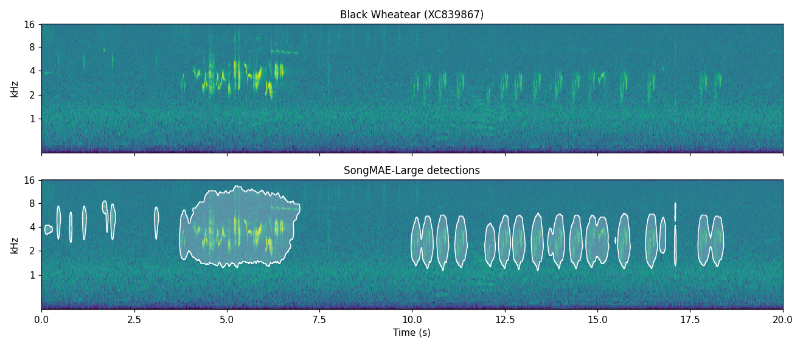

# birdsong-detect-distill

**TL;DR:** Fine-tuned SongMAE that detects birdsong in spectrograms, trained on labels from a
vision-language model.

## Install

```bash
python -m venv .venv
.venv/bin/pip install -r env/requirements-main.txt --extra-index-url https://download.pytorch.org/whl/cu118
.venv/bin/pip install -e . --no-deps
```

Run scripts from the repository root with `PYTHONPATH=src:scripts`.

## Detect vocalizations

```bash
PYTHONPATH=src:scripts python scripts/predict.py recording.wav \
    --checkpoint large_25000_s0.pt --out predictions/
```

### Example



Black Wheatear, [XC839867](https://xeno-canto.org/839867), not used in training: mel spectrogram
(top) and regions detected by SongMAE-Large (bottom, threshold 0.04). The detectors are on
Hugging Face as [georgeven/songmae-{micro,base,large}-32x1-bird-detector](https://huggingface.co/georgeven/songmae-large-32x1-bird-detector).
Recording by Esperanza Poveda, [CC BY-NC-SA 4.0](https://creativecommons.org/licenses/by-nc-sa/4.0/);
the image is an adaptation under the same license.
